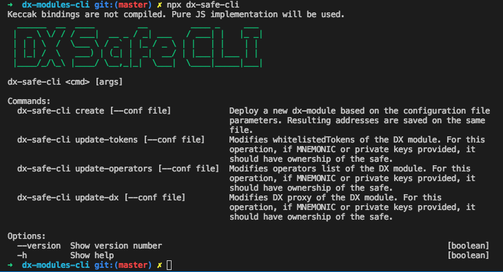

# DX Safe CLI

CLI that manages the creation of Dutch Exchange modules for the [Safe](https://safe.gnosis.io).

## Requirements
* Nodejs >= 8
* Git

## Install
```sh
# You can install it globally, in another project...
npm i -g @gnosis.pm/dx-safe-cli

# Or clone the repo
git clone https://github.com/gnosis/dx-safe-cli
cd dx-safe-cli
npm i
````

## Configuration file
There is an example of the configuration file in `conf/conf.json` fill the parameters desired values.

## Running the CLI
```sh
@gnosis.pm/dx-safe-cli # globally
./src/cli.js # locally
```

It will output all the possible options

